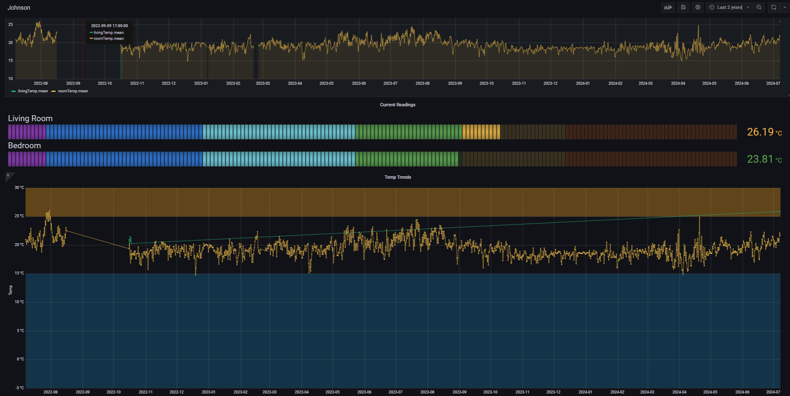

# One Wire Temp Telemetry

This is a repository for sharing my code from a project monitoring the temperature in my room since Covid lockdowns. This project was ported from an Arduino sketch to toe ESP-IDF using the Arduino framework on a NodeMCU 1.0 ESP8266 board. 

### Screenshot of Historic Temperatures from 2022

The orange time-series is the only device that hasnt been canibalized since soon after getting it working (:

### The Quick & Dirty Setup
Untouched except for cleaning since 2022.

---
By Hamish J
